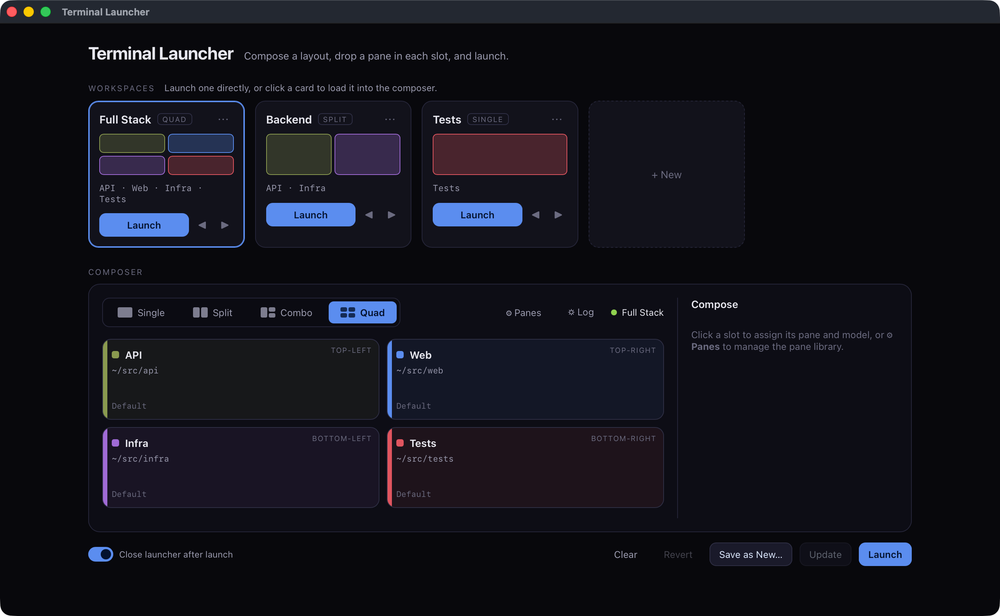
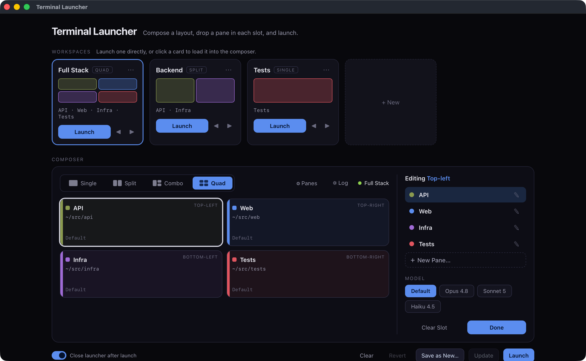
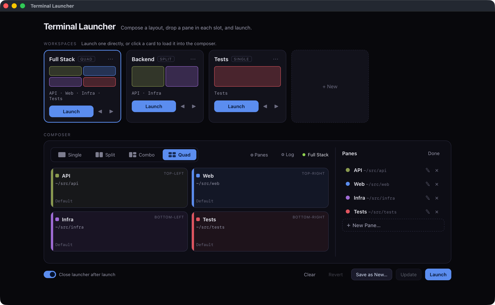

# Terminal Launcher

**Compose and launch tiled Claude Code sessions with one command.**

[](https://github.com/dberardi2020/terminal-launcher/actions/workflows/tests.yml)


You often want several Claude Code sessions open at once — each pointed at a different
part of your work, laid out side by side so you can see them together. Terminal Launcher
lets you define those terminals once as reusable **panes**, arrange them into a
**layout**, save the arrangement as a **workspace**, and launch the whole set — tiled,
named, and color-tagged — with a single command (native iTerm2 windows on macOS, Windows
Terminal windows on Windows).



## Model, in three words

- **Pane** — a terminal identity: `name · color · target dir · model`. Reusable.
- **Layout** — the shape: `single` (1), `split` (2 side-by-side), `combo` (3 — one full
  pane + two stacked), `quad` (2×2). `split` and `combo` can be flipped horizontally
  (saved per workspace). Leave slots empty and those positions are left as real desktop
  gaps on launch — every filled slot is its own window at its true position; empties
  never launch a shell.
- **Workspace** — a saved composition: a layout with a pane assigned to each slot.

Panes and workspaces are *data* (your config); the composer and launcher are the product.
Ship any pane set you like.

## Demo

Compose a workspace, assign each slot, and launch — all from one window.

**Assign a pane and pick its model.** Click any slot to open the inline editor: choose a
pane from your library, and optionally override its model just for that slot.



**Manage your reusable pane library.** Panes are identities you compose workspaces from —
add, edit, recolor, and retarget them without leaving the window.



## Requirements

- **Python 3.10+** (uses `from __future__ import annotations`; developed on 3.14).
- **A terminal backend** — the layer that spawns and tiles the panes:
  - **macOS → [iTerm2](https://iterm2.com)** (`brew install --cask iterm2`). Its Python
    API drives native windows; the first launch prompts once for Automation permission to
    control iTerm2.
  - **Windows → [Windows Terminal](https://aka.ms/terminal)**
    (`winget install Microsoft.WindowsTerminal`). Ships with Windows 11; spawned and
    placed via Win32 with no permission prompt.
- **Claude Code** (`claude`) on your `PATH` — what each filled pane runs.

## Install

**Recommended** — install the command with [pipx](https://pipx.pypa.io):

```sh
pipx install git+https://github.com/dberardi2020/terminal-launcher.git
```

That puts a `terminal-launcher` command on your `PATH` in its own isolated environment —
same on macOS, Linux, and Windows.

**From a checkout** — no install at all:

```sh
git clone https://github.com/dberardi2020/terminal-launcher.git
cd terminal-launcher
python3 -m terminal_launcher --help      # `py -m terminal_launcher` on Windows
```

Then seed a config and compose your first workspace (substitute `python3 -m
terminal_launcher` if you're running from a checkout):

```sh
terminal-launcher init        # seed ~/.config/terminal-launcher/workspaces.json
terminal-launcher new         # interactively compose + save a workspace
terminal-launcher launch Docs # tile it up
```

Optionally add the `/restore` Claude Code command as part of setup — it re-applies a pane's
color and name after `/clear`. See
[Restore identity](#restore-identity-after-clear-claude-code) for the one-line installer.

### Hand it to your coding agent

Already inside Claude Code (or Cursor, or any coding agent)? Paste this and it will do
the install for you:

```text
Install Terminal Launcher for my platform from
https://github.com/dberardi2020/terminal-launcher

- Preferred: `pipx install git+https://github.com/dberardi2020/terminal-launcher.git`
  — that gives me a `terminal-launcher` command on my PATH. If pipx isn't available,
  clone the repo and use `python -m terminal_launcher` from the checkout instead.
- Then run `terminal-launcher init` to seed my config, and walk me through
  `terminal-launcher new` to compose my first workspace.
- Optional (needs a checkout): add the `/restore` Claude Code command, which re-applies
  a pane's color and name after `/clear` —
  `./integrations/claude-code/install.sh` on macOS/Linux, or
  `powershell -ExecutionPolicy Bypass -File integrations\claude-code\install.ps1` on Windows.

It needs Python 3.10+, Claude Code (`claude`) on my PATH, and a terminal backend:
iTerm2 on macOS (`brew install --cask iterm2`) or Windows Terminal on Windows
(`winget install Microsoft.WindowsTerminal`). Tell me if anything is missing.
```

### Double-clickable app (optional)

You can also build a Dock/Start-Menu app for the visual composer — **macOS** via py2app,
**Windows** via PyInstaller (or a no-build Start Menu shortcut). See
[`packaging/README.md`](packaging/README.md); on macOS it's one command:
`./packaging/install-macos.sh`.

## Commands

| Verb | What it does |
|---|---|
| `list` | List saved workspaces. |
| `panes` | List configured panes. |
| `preview <name>` | Text preview of a workspace's layout. |
| `launch <name>` | Launch a workspace. `--dry-run` prints the plan; `--inject-color` types `/color` into each session. |
| `new` | Interactively compose a *new* workspace and save it. |
| `edit <name>` | Interactively edit an existing workspace. |
| `delete <name>` | Remove a workspace. |
| `pane-new` | Interactively add a new pane (terminal identity). |
| `gui` | Open the visual composer — a native window (launchpad + click-a-cell editor + pane management). |
| `init` | Create a starter config from the bundled example. |
| `restore` | Re-apply this pane's `/color` + `/rename` after Claude Code's `/clear` (see [Restore identity](#restore-identity-after-clear-claude-code)). `--detect-only` prints the identity without injecting. |

The interactive `new` / `edit` / `pane-new` verbs write back to the config — the CLI
and the visual composer edit the same file and never diverge.

## Configuration

One JSON file is the single source of truth for panes, workspaces, and settings.
Resolution order:

1. `--config <path>` or `TERMINAL_LAUNCHER_CONFIG`
2. `$XDG_CONFIG_HOME/terminal-launcher/workspaces.json`
3. `~/.config/terminal-launcher/workspaces.json`

See [`workspaces.example.json`](workspaces.example.json) for the shape. Model precedence
when launching a slot: `slot override → pane default → global default`.

## Identity in-session

A launched pane carries its identity three ways: the Claude **session name**
(`claude -n <name>`), the **pane title** (the iTerm2 session name on macOS, or the `wt`
tab title on Windows), and — optionally — the prompt-bar **color** (`/color <name>`,
injected with `--inject-color` or `settings.injectColor`). On macOS injection targets the
session directly (no Accessibility permission); on Windows it briefly focuses the window to
paste the command.

## Restore identity after `/clear` (Claude Code)

That in-session identity has one weak spot: Claude Code's `/clear` (and reconnecting to a
session) resets it — the color and name are gone even though the pane is still "the API
pane." The bundled `/restore` slash command puts it back. Run it right after `/clear` and
it re-detects which pane you're in — from the working directory, against your `panes`
registry — and re-issues `/color` and `/rename`. Detection is cross-platform; the
re-injection goes through the same backend seam that launches the panes (iTerm2 on macOS,
Windows Terminal on Windows). Verified on both.

Install the command once — macOS/Linux, or Windows:

```sh
./integrations/claude-code/install.sh                                          # macOS/Linux
powershell -ExecutionPolicy Bypass -File integrations\claude-code\install.ps1  # Windows
```

Then, in any launched pane, run `/restore` after a `/clear` — it's the packaged
`terminal-launcher restore` under the hood. Details and options:
[`integrations/claude-code/`](integrations/claude-code/README.md).

## Platform status

- **macOS** — verified end-to-end (spawn, tile, name, title, color) on the iTerm2 backend.
- **Windows** — verified end-to-end on the native Windows Terminal backend: geometry, window
  discovery, placement, and `/color` injection. Multi-monitor is not done yet (primary
  monitor only). See
  [`docs/product/platforms-and-status.md`](docs/product/platforms-and-status.md).

## The UI

Two composers over the same config:

- **CLI** (`new` / `edit`) — headless and scriptable.
- **Visual composer** (`terminal-launcher gui`) — a native window (pywebview, no web
  server): a launchpad of workspace cards, a click-a-cell slot editor, and inline pane
  management. It opens maximized, and on a fleeting launch it closes behind you.

## Roadmap

Shipped and stable on macOS (iTerm2) and Windows (Windows Terminal). What's deferred, not scheduled:

- **Multi-monitor placement** — slots derive from the primary display's work area, so a workspace always lands there.
- **Heterogeneous panes** — tiling a browser or file manager alongside the Claude terminals; needs a general OS-window placement layer.

Full detail and rationale in [Platforms & Status](docs/product/platforms-and-status.md#deferred--not-yet-built).

## Documentation

Full docs live in [`docs/`](docs/README.md):

- **[Product](docs/product/README.md)** — what it is and how to use it, no code assumed.
- **[Technical](docs/technical/README.md)** — architecture, backends, data model, packaging.
- **[Decisions](docs/decisions/README.md)** — the architecture decision records (*why* it's built this way).

## License

[MIT](LICENSE) © Dimitri Berardi
